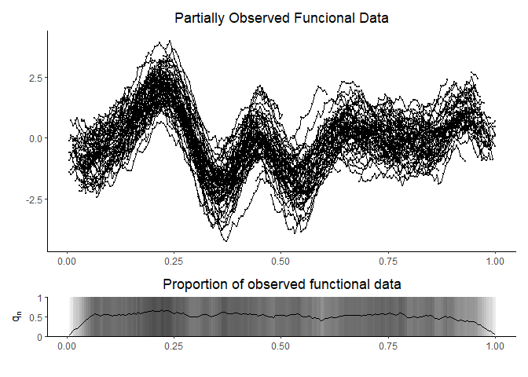
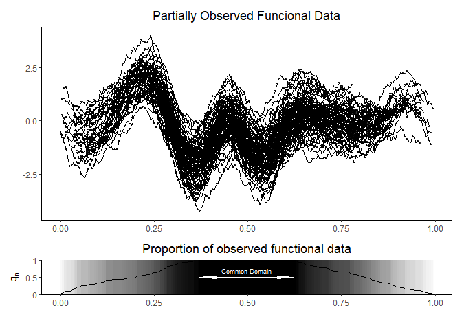

POIFD
=====

<!-- badges: start -->

[](https://www.gnu.org/licenses/gpl-3.0)
[](https://travis-ci.com/aefdz/dbPoFDA)
<!-- badges: end -->

Overview
--------

Software companion for the paper “Integrated Depth for Partially
Observed Functional Data” (Elías, Antonio, Jiménez, Raúl, Paganoni, Anna
M. and Sangalli, Laura M., 2020).

It implements the proposed depth measures, functional boxplot and
functional outliergram for partially observed functional data.

Installation
------------

``` r
#install the package
devtools::install_github("aefdz/fdaPOIFD")

#load the package
library(fdaPOIFD)
```

Test usage
----------

``` r
#plot the data sets
plot_interval <- plotPOFD(exampleData$PoFDintervals)
plot_common <- plotPOFD(exampleData$PoFDextremes)

plot_interval
```

    ## Warning: Removed 3014 row(s) containing missing values (geom_path).



``` r
plot_common
```

    ## Warning: Removed 7468 row(s) containing missing values (geom_path).



### Computing depths

``` r
data("exampleData")

mbd <- POIFD(exampleData$PoFDintervals, type = "MBD")

(median <- mbd[1])
```

    ##       45 
    ## 0.442687

-   Fraiman, R. and Muniz, G. (2001). Trimmed means for functional data.
    *Test*, 10(2):419–440.
-   López-Pintado, S. and Romo, J. (2009). On the concept of depth for
    functional data. *Journal of the American Statistical Association*,
    104(486):718–734.
-   López-Pintado, S. and Romo, J. (2011). A half-region depth for
    functional data. *Computational Statistics and Data Analysis*,
    55(4):1679–1695.

### Functional Boxplot and magnitude outliers

``` r
data(exampleData)

fboxplot <- boxplotPOFD(exampleData$PoFDextremes_outliers, centralRegion = 0.5, fmag = 1.5, fdom = 1)

fboxplot$magnitude
```

    ## 101 102 
    ## 101 102

``` r
fboxplot$domain
```

    ## 101 102 
    ## 101 102

``` r
fboxplot$fboxplot
```

    ## Warning: Removed 119 row(s) containing missing values (geom_path).

    ## Warning: Removed 27 row(s) containing missing values (geom_path).

    ## Warning: Removed 27 row(s) containing missing values (geom_path).


-   Sun, Y. and Genton, M. G. (2011). Functional boxplots. *Journal of
    Computational and Graphical Statistics*, 20(2):316–334.

### Functional Outliergram and Shape Outliers

``` r
outliergram <- outliergramPOFD(exampleData$PoFDextremes_outliers)

outliergram$shape
```

    ## [1] 103 104

``` r
outliergram$outliergram
```


-   Arribas-Gil, A. and Romo, J. (2014). Shape outlier detection and
    visualization for functional data: the outliergram. *Biostatistics*,
    15(4):603–619.

References
----------

Elías, Antonio, Jiménez, Raúl, Paganoni, Anna M. and Sangalli, Laura M.
(2020). Integrated Depths for Partially Observed Functional Data.
(submitted)
