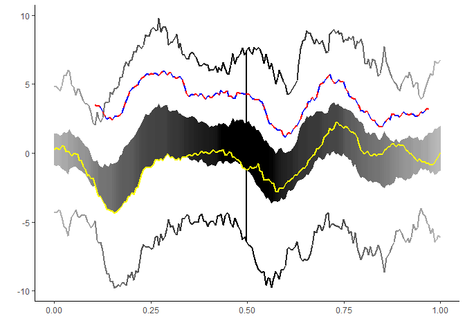
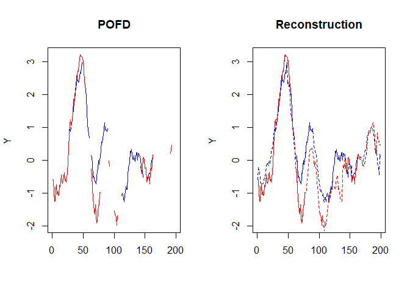

# POIFD

<!-- badges: start -->

[](https://www.gnu.org/licenses/gpl-3.0)
[](https://travis-ci.com/aefdz/dbPoFDA)
<!-- badges: end -->

## Overview

Software to compute Integrated Depth for Partially Observed Functional
Data and applications

It implements the proposed depth measures, functional boxplot,
functional outliergram for partially observed functional data and
reconstruction methods.

## Installation

``` r
#install the package
devtools::install_github("aefdz/fdaPOIFD")

#load the package
library(fdaPOIFD)
```

## Test usage

``` r
#plot the data sets
plot_interval <- plotPOFD(exampleData$PoFDintervals)
plot_common <- plotPOFD(exampleData$PoFDextremes)

plot_interval
```

    ## Warning: Removed 2914 rows containing missing values or values outside the scale range
    ## (`geom_line()`).

    ## Warning: Removed 9900 rows containing missing values or values outside the scale range
    ## (`geom_point()`).


``` r
plot_common
```

    ## Warning: Removed 7368 rows containing missing values or values outside the scale range
    ## (`geom_line()`).

    ## Warning: Removed 7368 rows containing missing values or values outside the scale range
    ## (`geom_point()`).


### Computing depths

Example with partially observed common domain. Data is in a matrix form:

``` r
mbd <- POIFD(exampleData$PoFDintervals, type = "MBD")

(median <- which.max(mbd)) # deepest curve
```

    ## 45 
    ## 45

-   Fraiman, R. and Muniz, G. (2001). Trimmed means for functional data.
    *Test*, 10(2):419–440.
-   López-Pintado, S. and Romo, J. (2009). On the concept of depth for
    functional data. *Journal of the American Statistical Association*,
    104(486):718–734.
-   López-Pintado, S. and Romo, J. (2011). A half-region depth for
    functional data. *Computational Statistics and Data Analysis*,
    55(4):1679–1695.

Example without partially observed common domain. It implements an step
to estimate the observation domain. Data is in a list form:

``` r
exampleData$PoFDintervals_list[[1]]
```

    ## $x
    ## [1] 0.000000000 0.005050505 0.010101010
    ## 
    ## $y
    ## [1] 0.7814341 0.7939221 0.8063511

To compute the POIFD, we need to include the vector where the data
should be evaluated:

``` r
mbd <- POIFD(exampleData$PoFDintervals_list, type = "MBD", t = seq(0, 1, length.out = 100))

(median <- which.max(mbd)) # deepest curve
```

    ## 44 
    ## 44

-   Elías, A., Nagy, S. (2025). ’ Statistical Properties of Partially
    Observed Integrated Funcional Depths. ’ TEST, 34, 125-150.

### Functional Boxplot and magnitude outliers

``` r
fboxplot <- boxplotPOFD(exampleData$PoFDextremes_outliers, centralRegion = 0.5, fmag = 1.5, fdom = 1)

fboxplot$magnitude
```

    ## 102 
    ## 102

``` r
fboxplot$domain
```

    ## 102 
    ## 102

``` r
fboxplot$fboxplot
```

    ## Warning: Removed 27 rows containing missing values or values outside the scale range
    ## (`geom_line()`).
    ## Removed 27 rows containing missing values or values outside the scale range
    ## (`geom_line()`).



-   Sun, Y. and Genton, M. G. (2011). Functional boxplots. *Journal of
    Computational and Graphical Statistics*, 20(2):316–334.

### Functional Outliergram and Shape Outliers

``` r
outliergram <- outliergramPOFD(exampleData$PoFDextremes_outliers)

outliergram$shape
```

    ## [1] 103 104

``` r
outliergram$outliergram
```


-   Arribas-Gil, A. and Romo, J. (2014). Shape outlier detection and
    visualization for functional data: the outliergram. *Biostatistics*,
    15(4):603–619.

### Depth-based Reconstruction of Partially Observed Functional data

It implements a reconstruction method based on the partially observed
functional depth and the algorithm proposed in Elías, A., Jiménez, R.
and Shang, HL. (2022).

``` r
data <- exampleData$PoFDintervals
recons_data <- depthbasedreconstructionPOFD(data, id_recons = c(1:2))

par(mfrow = c(1,2))
matplot(data[,1:2], col = c("blue", "red"), type ="l", lty = 1, main = "POFD", ylab = "Y")

matplot(data[,1:2], col = c("blue", "red"), type ="l", lty = 1, main = "Reconstruction", ylab = "Y")
matplot(recons_data, col = c("blue", "red"), add = TRUE, type = "l", lty = 2, main = "Reconstruction", ylab = "Y")
```



``` r
par(mfrow = c(1,1))
```

-   Elías, A., Jiménez, R. and Shang, HL. (2022) On projection methods
    for functional time series forecasting, Journal of Multivariate
    Analysis, Volume 189, 2022.

## References

-   Elías, A., Jiménez, R. and Shang, HL. (2022) On projection methods
    for functional time series forecasting, Journal of Multivariate
    Analysis, Volume 189, 2022.

-   Elías, A., Jiménez, R., Paganoni, A. M., & Sangalli, L. M. (2023).
    Integrated depths for partially observed functional data. Journal of
    Computational and Graphical Statistics, 32(2), 341-352.

-   Elías, A., Jiménez, R., & Shang, H. L. (2023). Depth-based
    reconstruction method for incomplete functional data. Computational
    Statistics, 38(3), 1507-1535.

-   Elías, A., Nagy, S. (2025). Statistical Properties of Partially
    Observed Integrated Funcional Depths. TEST, 34, 125-150.
